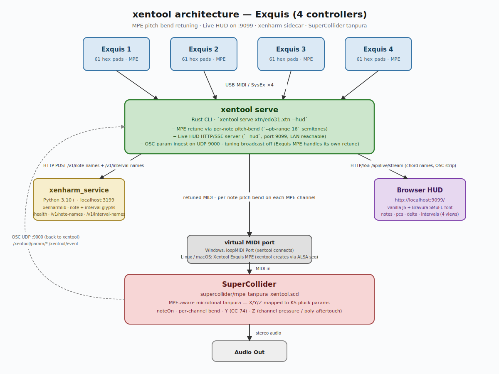
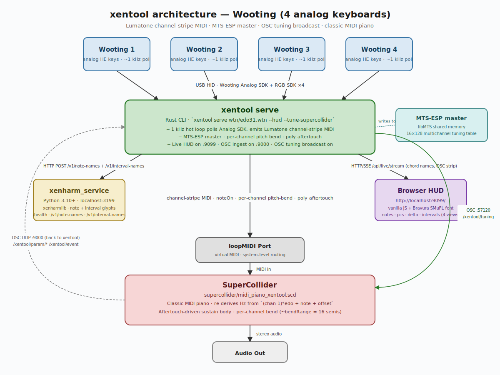

# xentool

A microtonal-tuning bridge for two expressive MIDI controllers:

- **Exquis** — Intuitive Instruments' 61-pad MPE hex grid (single or multi-board).
- **Wooting** — analog gaming keyboards repurposed as a velocity- and
  pressure-sensitive isomorphic controller (the [xenwooting](https://github.com/mcleinn/xenwooting)
  use case).

Plug the controller into your computer, point xentool at a layout file
(`.xtn` or `.wtn`), and any MIDI synth on the other end plays in any
EDO you like — 12, 24, 31, 53, your choice. xentool handles the
microtonal retuning, LED colours, expressive MPE / aftertouch routing,
and the live overview.

It runs on Windows, Linux (including Patchbox OS / Raspberry Pi), and
macOS.

---

## Features

**Play microtonally with any synth**

- Pitch-bend retuning for the Exquis (works with any MPE synth).
- MTS-ESP master for the Wooting (works with any MTS-ESP-aware synth
  — Pianoteq, amsynth_multichannel, …).
- Stays in stock 12-TET if you load a 12-EDO layout — no quirks.

**Live overview as you play**

- **Live HUD** in the browser: notes / pitch-classes / intervals /
  chord names with proper Bravura microtonal accidentals — auto-fits
  the screen, LAN-reachable from a phone or tablet, four taps cycle
  the views.
- Bundled chord database with 844 chord templates from Manuel Op de
  Coul's Scala project.

**Touchscreen studio for the bundled synths**

- **Tanpura studio** (Exquis backend, port 9100) tweaks the included
  microtonal tanpura: drone, jawari, EQ, Y-axis effect (resonant LPF
  wah, formant, tremolo, comb), reverb, master.
- **Piano studio** (Wooting backend, port 9101) tweaks the included
  piano patch: voice mode (piano / Hammond organ / Rhodes EP), ADSR,
  three-string detune, drone, Y-axis effect (LPF / tremolo / Leslie
  / chorus / vibrato), reverb.
- Both UIs share the same shape: big sliders, accordion sections,
  Save / Load presets, "Make default" so your sound boots that way
  next time, "Factory reset" to roll back. Fast and finger-friendly.

**Layouts**

- Visual web editor for `.xtn` / `.wtn` / `.ltn` (Lumatone) files —
  paint pads, set tunings, import other layouts, rotate, translate,
  save.
- Multi-board for Exquis (up to 4 boards in one stack).
- Per-pad colours stored alongside the tuning.

**Optional bundled sounds** under `supercollider/`:

- Microtonal tanpura SynthDef (Exquis MPE), with all the Indian-string
  expressivity the studio UI exposes.
- Multi-voice piano / organ / Rhodes EP SynthDef (Wooting),
  pitch-derived from the layout's EDO so it stays in tune without
  needing an MTS-ESP client.

---

## How it fits together

A typical Exquis setup — controller → xentool → virtual MIDI port →
your synth, with the optional Live HUD, xenharm sidecar, bundled
SuperCollider tanpura, and tanpura studio touchscreen UI:



The Wooting setup is the same shape, but the analog keys go through
a 1 kHz polling loop and tuning is published over MTS-ESP plus an
OSC tuning broadcast to SC. The bundled piano patch and piano studio
sit in the same place the tanpura ones do for Exquis:



You don't need every box — the Live HUD, xenharm, SuperCollider, and
the studio UI are all optional. Even the bundled SC patches are
optional: any MPE / MTS-ESP synth on the other side of the virtual
MIDI port works.

---

## Install

Pick the install path that matches your OS, then jump to
[Quick start](#quick-start).

### Linux (Patchbox OS, Raspberry Pi OS, Ubuntu on Pi 4/5)

Each script is **interactive**: it shows the plan up front, prompts
before each component, and only installs what you accept.

```bash
# Exquis MPE controller:
bash scripts/install-linux-exquis.sh

# Wooting analog keyboard (also installs the Wooting Analog + RGB SDKs):
bash scripts/install-linux-wooting.sh
```

Either script will offer to install:

1. Build prerequisites and Rust, then build `xentool` to `~/.cargo/bin/`.
2. (Wooting only) the Wooting Analog + RGB SDKs.
3. The **xenharm** Python sidecar (microtonal note glyphs in the HUD).
4. **SuperCollider** with the matching bundled patch.
5. The matching **studio web UI** (tanpura or piano).
6. `systemd --user` units (`xenharm`, `xentool`, optionally
   `xentool-supercollider`, optionally `xentool-studio`) so it all
   starts on boot.

After install:

| What you want to do                              | Command                                              |
|--------------------------------------------------|------------------------------------------------------|
| Open the **Live HUD**                            | <http://localhost:9099/>                             |
| Open the **studio web UI** (if installed)        | <http://localhost:9100/> (Exquis) · <http://localhost:9101/> (Wooting) |
| Attach to xentool's **TUI** (detach: `Ctrl-b d`) | `xentool-tui`                                        |
| Tail logs                                        | `journalctl --user -u xentool -f`                    |
| Manage the service                               | `systemctl --user {status,restart,stop} xentool`     |

### Windows

```powershell
# build + install:
cargo install --path .

# Wooting SDKs (only needed for the Wooting backend):
powershell -ExecutionPolicy Bypass -File scripts\install-wooting-sdks.ps1
```

Or run `scripts\install.bat` for the equivalent.

#### One-click full stack

To bring up xentool, the xenharm sidecar, the matching SuperCollider
synth, and the matching studio web UI in **one** Windows Terminal
window — four labelled tabs, started with the right delays — pick
the script for your hardware and double-click:

| Hardware | Script                          | Default layout    | Bundled sound + studio                    |
|----------|---------------------------------|-------------------|-------------------------------------------|
| Exquis   | `scripts\run-all-exquis.bat`    | `xtn\edo31.xtn`   | tanpura + tanpura studio (port 9100)      |
| Wooting  | `scripts\run-all-wooting.bat`   | `wtn\edo31.wtn`   | piano + piano studio (port 9101)          |

Falls back to separate cmd windows if Windows Terminal isn't installed.
Override the layout or SC patch by setting `LAYOUT` / `SC_SCRIPT`
before launching:

```powershell
set LAYOUT=C:\Dev-Free\xentool\xtn\edo24.xtn
scripts\run-all-exquis.bat
```

To stop one subsystem, focus its tab and press Ctrl-C; to stop
everything, close the window.

### macOS

```bash
cargo install --path .
```

The Wooting SDKs aren't auto-installed on macOS — build them from
upstream sources if you need the Wooting backend.

### Build from source (any platform)

```bash
cargo build           # debug
cargo build --release # release
cargo test            # full test suite
```

---

## Quick start

1. Plug in your Exquis or Wooting.
2. Pick a layout from `xtn/` or `wtn/` (e.g. `edo31.xtn`) and run:
   ```
   xentool serve xtn/edo31.xtn --hud
   ```
3. Point your synth at xentool's MIDI output (see
   [Synth compatibility](#synth-compatibility)).
4. Open <http://localhost:9099/> for the Live HUD.
5. (Optional) open <http://localhost:9100/> (Exquis) or
   <http://localhost:9101/> (Wooting) for the touchscreen studio if
   you're using the bundled SC patch.
6. Play.

---

## Live HUD

Add `--hud` to any `xentool serve` command. Starts a small HTTP server
(default `0.0.0.0:9099` so phones and tablets on the LAN can connect)
and a browser-based view that shows currently-played notes in proper
musical notation with the Bravura SMuFL font. Auto-fits the viewport,
dark, no chrome.

Tap or click anywhere to cycle four views:

| View        | Shows                                                                       |
|-------------|------------------------------------------------------------------------------|
| `notes`     | pressed pitches as Bravura glyphs (with up/down arrow microtonal accidentals) |
| `pcs`       | one entry per pitch class (`14₃-21₃-3₄`)                                     |
| `delta`     | root pitch + `+N` step offsets to the other notes                            |
| `intervals` | chord-name candidates from the bundled Scala chord database                  |

For full microtonal note names you also need the **xenharm** sidecar
(installed automatically on Linux when prompted; manual setup on
Windows/macOS — see [`xenharm_service/`](xenharm_service/)). Without
it, the HUD falls back to numeric labels.

Tap a single note glyph to cycle its enharmonic spellings (e.g.
sharp ↔ flat). Tap empty space to cycle the four views.

---

## Studio touchscreen web UI

Each backend ships with a small web UI that exposes the bundled
SuperCollider synth's parameters as touch-friendly sliders and
dropdowns, with live updates to held notes via OSC.

| Backend  | UI                  | URL                       | Synth target                  |
|----------|---------------------|---------------------------|-------------------------------|
| Exquis   | **tanpura studio**  | <http://localhost:9100/>  | `mpe_tanpura_xentool.scd`     |
| Wooting  | **piano studio**    | <http://localhost:9101/>  | `midi_piano_xentool.scd`      |

Both UIs share a layout: accordion sections of sliders / dropdowns,
big finger-sized targets, and four header buttons:

- **Save preset** — writes a timestamped snapshot to `presets/`.
- **Load** — pick a saved preset; values apply atomically.
- **Make default** — promotes the current state to `_default.json`.
  On next startup, those values load automatically. **Reset** also
  goes there.
- **Factory reset** — deletes `_default.json` and rolls back to the
  hardcoded patch defaults.

Slider moves are pushed live to every currently-held voice, so you
can hold a chord and reshape its sound in real time.

**What the tanpura studio exposes:** decay / damp / brightness for
the strings, drone amount + type (CombL feedback / Sine + harmonics
/ Saw / Triangle / Beating sines / Pulse), jawari nonlinearity (mix
+ drive + mode), sympathy delay, Y-axis effect (EQ shelves /
resonant LPF wah / bandpass formant / tremolo / pluck-position
comb), press swell range, limiter, reverb, master.

**What the piano studio exposes:** voice (piano / Hammond organ /
Rhodes EP), ADSR, piano string detune (0 = unison → 0.01 ≈
honky-tonk), hammer hardness, drone amount + type, Y-axis effect
(off / LPF / tremolo / Leslie / chorus / vibrato), Leslie speeds,
reverb, master.

The Linux installer offers to set up the matching studio as a
systemd user service. The Windows `run-all-*.bat` launchers open it
as the 4th tab in their stack.

---

## Synth compatibility

xentool is **synth-agnostic** — it produces standard MIDI on a virtual
MIDI port (loopMIDI on Windows, snd-seq on Linux). Any synth that
reads from that port can be the audio engine.

| Backend  | Target synth                                                | Synth pitch-bend range                                 | How microtones reach the synth                                                          |
|----------|-------------------------------------------------------------|-------------------------------------------------------:|------------------------------------------------------------------------------------------|
| Exquis   | any **MPE-capable** synth                                   | **±16 semitones** *(must match `--pb-range`)*          | per-note pitch-bend injected before each note-on                                         |
| Wooting  | any **MTS-ESP master client with multichannel tuning**      | user's choice (e.g. ±2 for piano, ±12 for organ)       | xentool registers as MTS-ESP master and pushes a 16×128 multichannel tuning table        |

For the **Exquis** flow, point any MPE synth (Pianoteq, Equator2,
MPE-aware Surge XT, amsynth_multichannel, …) at xentool's MIDI output
and set its **per-note pitch-bend range to ±16 semitones** to match
the default. xentool's microtonal retunes ride on the bend channel,
so the synth-side range must match exactly.

For the **Wooting** flow, point any MTS-ESP master client *with
multichannel tuning support* at xentool's output. Single-channel
MTS-ESP-only synths will read the wrong frequencies because the
Lumatone-style channel-stripes assign different pitches to the same
MIDI note number on different channels.

If microtones aren't desired, just pick `xtn/edo12.xtn` /
`wtn/edo12.wtn` — the synth then receives ordinary chromatic MIDI.

### Optional bundled SuperCollider sounds

For quick testing without configuring an external synth:

| Patch                      | Backend  | What it is                                                                                |
|----------------------------|----------|-------------------------------------------------------------------------------------------|
| `mpe_tanpura_xentool.scd`  | Exquis   | MPE microtonal tanpura · X/Y/Z → KS pluck params                                          |
| `midi_piano_xentool.scd`   | Wooting  | Multi-voice piano / organ / Rhodes EP · re-derives Hz from the layout's EDO (no MTS-ESP)  |

Both can be tweaked live via their studios (above). Both also push
parameter changes back to the HUD via OSC, so encoder turns and
button presses appear as a sticky parameter strip + brief event log
on the right edge of the HUD page.

---

## Layout editor

```
xentool edit xtn/edo31.xtn
xentool edit wtn/edo31.wtn
```

Opens a web-based editor in your default browser. Each connected /
configured board renders as a hex panel; Key / Chan / Colour are
edited in the sidebar. Save writes back to the file.

Import: pick a `.ltn` (Lumatone), `.wtn` (xenwooting), or another
`.xtn`. Use arrow keys to translate, `R` to rotate 60° around the
hovered pad. Enter applies the overlay; Esc cancels. Colours
round-trip losslessly.

---

## File-extension routing

A single `xentool` binary handles both backends — the file extension
picks the backend:

| Extension | Backend | Layout format              |
| --------- | ------- | -------------------------- |
| `.xtn`    | Exquis  | xentool-native (INI)       |
| `.wtn`    | Wooting | xenwooting (INI)           |
| `.ltn`    | import  | Lumatone (read-only via `edit`) |

So `xentool serve foo.xtn` runs the Exquis serve loop and `xentool
serve foo.wtn` runs the Wooting serve loop. Same for `load` / `new`.

---

## Exquis backend

### `xentool serve <file.xtn>` — microtonal tuning server

```
xentool serve xtn/edo31.xtn
xentool serve xtn/edo31.xtn --pb-range 48
xentool serve xtn/edo31.xtn --output "My MIDI Port"
xentool serve xtn/edo31.xtn --mts-esp
```

Loads the layout, sets pad colours on connected boards, and runs a
live microtonal tuning server with a terminal UI showing active
touches and tuning status.

Uses **pitch-bend retuning** by default: each MPE channel carries a
note plus a tiny per-note bend that shifts it to its exact microtonal
frequency. The synth's per-note pitch-bend range must match
`--pb-range` (default 16 semitones); otherwise the EDO quantisation
drifts. Pass `--mts-esp` to switch to MTS-ESP master mode instead
(one global 128-note table; one master per machine; max 128 unique
notes).

**Windows requires loopMIDI** — install
[loopMIDI](https://www.tobias-erichsen.de/software/loopmidi.html),
create a port named `loopMIDI Port`, and point your synth at it.

**Linux / macOS** — xentool creates its own subscribable virtual
MIDI port (`Xentool Exquis MPE`) via ALSA seq / CoreMIDI. No virtual
cable needed.

Multi-board: each board gets its own tuning state. Scales to 4+.

### `xentool list` / `xentool midi`

```
xentool list                                # all connected MIDI ports + Wooting devices
xentool midi                                # hybrid live MPE monitor
xentool midi --mode stream --mpe-only       # stream-of-events, MPE only
xentool midi --device 1 --log-file …        # JSONL logging
```

`xentool midi` shows active touches with live `X/Y/Z`, channel,
note, value — press `q` to quit. Every session also logs to JSONL
under `%LOCALAPPDATA%\xentool\logs\` (Windows) or `logs/` (Linux)
unless `--no-log`.

### Pad colours, dev mode, control LEDs

```
xentool pads fill amber                  # paint all pads
xentool pads clear
xentool pad 17 blue                      # paint one pad
xentool control settings red             # paint a control LED
xentool highlight 60                     # highlight middle C (firmware-green only)
xentool dev on                           # explicit developer-mode control
xentool dev off
```

All pad colour commands use the **MPE-safe snapshot technique** by
default — colours appear without disabling pitch-bend / CC74 /
aftertouch. Pass `--legacy` to take over the pad zone in dev mode
instead (full LED freedom, but MPE expression turns off).

### `xentool load <file.xtn>` — paint LEDs from a layout

Loads an `.xtn` file (INI, compatible with `.wtn` / `.ltn`) and
applies per-pad colours. Each `[BoardN]` section maps to a logical
device name in `devices.json`. With one board section and one Exquis
connected, auto-matches without config.

Per-pad fields: `Key_N` (virtual MIDI note for the EDO calculation,
not sent to the device), `Chan_N` (virtual MIDI channel), `Col_N`
(hex RGB).

Frequency formula (used by `serve`):
```
virtual_pitch = (Chan - 1) × Edo + Key + PitchOffset
```

### Multi-Exquis device config

`devices.json` at `%LOCALAPPDATA%\xentool\config\devices.json` maps
logical board names to USB serial numbers:

```json
{
  "devices": {
    "board0": { "serial": "ABC123" },
    "board1": { "serial": "DEF456" }
  }
}
```

Auto-created/updated by `sync_boards()` on every `load`/`serve`
command — manual edits only needed to pin a preferred ordering.

---

## Wooting backend

The Wooting backend turns each analog key into a microtonal MIDI key
with continuous aftertouch. Loads the Wooting Analog + RGB SDKs at
runtime.

### `xentool serve <file.wtn>` — analog-to-MIDI server

```
xentool serve wtn/edo31.wtn
xentool serve wtn/edo31.wtn --output "loopMIDI Port"      # Windows
xentool serve wtn/edo31.wtn --output "Xentool Wooting"    # Linux
```

Loads the layout, paints LEDs, registers as MTS-ESP master, and runs
a 1 kHz polling hot loop that reads per-key analog depths and emits
velocity-mapped Note On/Off + continuous poly-pressure on a virtual
MIDI port. Terminal UI shows currently-held notes and event log;
press `q` to quit.

**MIDI output port:**

- **Windows:** xentool *connects to* a virtual cable. Install
  loopMIDI and create a port named `loopMIDI Port`.
- **Linux / macOS:** xentool *creates* its own subscribable port
  (`Xentool Wooting`). Override the name with `--output "<name>"`.

**Live in-keyboard controls** (key bindings on the Wooting itself):

| Key             | Action                                              |
| --------------- | --------------------------------------------------- |
| Right Alt       | Cycle aftertouch mode (speed → peak → off)          |
| Space (held)    | Octave hold (toggle per board)                       |
| Arrow Left/Right | Adjust press threshold *or* aftertouch speed max    |
| Arrow Down      | Cycle velocity profile (linear / gamma / log / inv-log) |
| Left Ctrl / Alt | Pitch bend up / down (analog → bend)                 |
| Left Meta       | Configurable analog CC                               |
| Context Menu    | Cycle to next `.wtn` file in `./wtn/`                |

A configurable idle screensaver blanks all LEDs (`screensaver_timeout_sec`
in `settings.json` → `wooting.rgb`); the next press wakes it (no
spurious note).

### `xentool new` / `xentool load`

```
xentool new my_layout.wtn --edo 31           # blank 4×14 grid
xentool load my_layout.wtn                   # paint LEDs
```

`.wtn` files are INI, structurally similar to `.xtn`. `[Board0]`
section per board, `Key_N` / `Chan_N` / `Col_N` per cell. xenwooting
files load directly — same format.

### Tuning behaviour

Wooting `serve` is **MTS-ESP only** — the synth must be an MTS-ESP
client with multichannel tuning (e.g. Pianoteq). Single-channel
MTS-ESP synths read the wrong frequencies.

Bend keys (Left Ctrl / Left Alt) emit raw 14-bit pitch-bend that
xentool relays without scaling, so the synth-side bend range is
your call: ±2 for pianistic feel, ±12 for organ portamento. The
bundled SC piano patch defaults to ±2.

---

## Pushing your own params to the HUD from any OSC client

xentool listens for OSC on UDP `9000` by default (override with
`--osc-port`). Send `/xentool/param/<group>/<name> <value> [<unit>]`
for a sticky parameter, or `/xentool/event <text>` for a one-off log
line. The bundled SC patches use this to surface synth state on the
HUD's right-edge strip.

```sclang
~hud = NetAddr("127.0.0.1", 9000);
~hud.sendMsg("/xentool/param/filter/cutoff", 880.0, "Hz");
~hud.sendMsg("/xentool/event", "preset → bright");
```

---

## Technical reference

### Pitch-bend retuning (Exquis serve, default)

For each pad, the exact target frequency is computed from the .xtn's
`Key_N` / `Chan_N` and the `Edo` value. The nearest 12-TET MIDI
note is chosen and the pitch-bend offset to reach the exact
microtonal frequency is calculated. On each `note_on`, a pitch-bend
message is injected before the `note_on` on the same MIDI channel.
Player X-axis bends are added to the tuning offset; Y (CC74) and Z
(channel pressure / poly aftertouch) pass through unchanged.

### MTS-ESP master (Exquis `--mts-esp` and Wooting `serve`)

For the Wooting flow xentool publishes both:

- a global 128-note tuning table (for non-multichannel-aware clients),
- a 16×128 multichannel tuning table — one full 128-note table per
  MIDI channel, required because Lumatone-style channel-stripes
  assign different absolute pitches to the same MIDI note number on
  different channels.

Loaded at runtime from `LIBMTS.dll` on Windows, `libMTS.so` /
`libMTS.dylib` elsewhere.

### Snapshot LED technique (Exquis)

The Exquis developer-mode API requires taking over the pad zone to
set LED colours, which **disables MPE output**. The Snapshot command
(`09h`) sidesteps this: enter dev mode for non-pad zones only (mask
`0x3A`), then send a 262-byte snapshot SysEx that encodes both MIDI
note mappings and RGB colours for all 61 pads. Pads stay in normal
mode, so MPE is preserved.

This is the default for `pad`, `pads fill`, `pads clear`, `pads test`.
Pass `--legacy` to fall back to direct dev-mode takeover (loses MPE).
Discovered via [PitchGridRack](https://github.com/peterjungx/PitchGridRack).

### `--tune-supercollider` (Wooting flow)

SuperCollider has no MTS-ESP client, so on the Wooting flow xentool
also broadcasts the active tuning to UDP `127.0.0.1:57120`:

```
/xentool/tuning <edo:int> <pitch_offset:int> <layout_id:str>
```

at startup, on every layout cycle, and every 3 s as a resync.
`midi_piano_xentool.scd` listens for this so a tuning swap reaches
the synth without restarting sclang.

The flag is **off** by default, **on** in `run-all-wooting.bat`,
and not used by `run-all-exquis.bat`.

### Wooting settings file

User-tunable parameters live in
`%LOCALAPPDATA%\xentool\config\settings.json` under the `wooting`
section. Defaults are ported from xenwooting and cover press
threshold, peak-tracking window, aftertouch deltas, screensaver
timeout, control-bar key map, and per-board CC/RGB index. See
`src/settings.rs` for the full list.

---

## Help & reporting issues

```
xentool help
xentool help midi
xentool --help
```

Issues, bug reports, feature requests:
<https://github.com/mcleinn/xentool/issues>.
